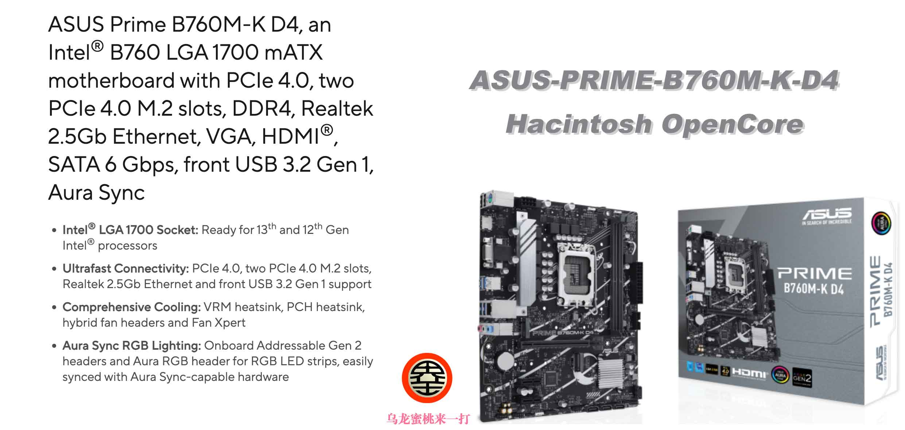

# [ASUS-PRIME-B760M-K-D4](https://github.com/hackintosh-club/ASUS-PRIME-B760M-K-D4-OpenCore) Hackintosh OpenCore EFI

### [简体中文](https://github.com/hackintosh-efi/MAG-B660M-MORTAR-WIFI-DDR4-OpenCore)

[OpenCore 1.0.0](https://github.com/acidanthera/OpenCorePkg)

### OS Version Tested

- macOS Sonoma 14.x
- macOS Ventura 13.6
- macOS Monterey 12.x

### Hardware

- Motherboard: ASUS PRIME B760M-K D4
- Bios Version: 1402（2023/09/18）
- CPU: Intel 12th i5-12400F
- RAM: Juhor 2x16GB DDR4 3600MHz
- GPU:Sapphire Radeon RX 5700 XT 8GB
- Audio: Realtek ALC897
- Ethernet: Realtek 2.5GbE Family Controller
- Wireless: None

### Bios Setup

### 

| Name               | Option   |      | Name          | Option   |
| ------------------ | -------- | ---- | ------------- | -------- |
| VT-d               | Enabled  |      | XHCI-Hand-Off | Enabled  |
| Above 4G Decoding  | Enabled  |      | Fast Boot     | Disabled |
| CSM                | Disabled |      | Secure Boot   | Disabled |
| Resize Bar Support | Enabled  |      |               |          |

### Notes

- Use[OCAuxiliaryTools](https://github.com/ic005k/OCAuxiliaryTools/releases) or [OpenCore Configurator](https://mackie100projects.altervista.org/opencore-configurator/) build your SMBIOS
- If you want to use a CPU with Efficient-Core, you must check the option in the config.plist file Kernel--ProvideCurrentCpuinfo

### Contact Us

- QQ Group: 23304408

