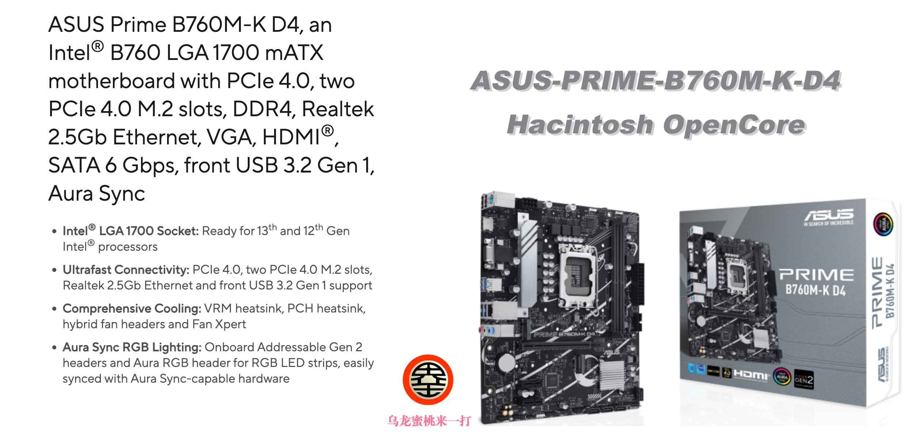

# [ASUS-PRIME-B760M-K-D4](https://github.com/hackintosh-club/ASUS-PRIME-B760M-K-D4-OpenCore)  黑苹果 OpenCore EFI

### [English](README.EN.md)

[OpenCore 0.9.8](https://github.com/acidanthera/OpenCorePkg)

### 可安装系统

- macOS Sonoma 14.x
- macOS Ventura 13.x
- macOS Monterey 12.x

### 硬件

- 主板: ASUS PRIME B760M-K D4
- Bios版本: 1402（2023/09/18）
- 处理器: 英特尔12代 i5-12400F
- 内存: 玖合 2x16GB DDR4 3600MHz
- 独显: 蓝宝石 Radeon RX 5700 XT 8GB
- 声卡: 瑞昱 ALC897
- 网卡: 瑞昱 2.5Gbe 有线网卡
- 无线：未安装无线网卡

### Bios 设置

### 

| 名称               | 选项     |      | 名称          | 选项     |
| ------------------ | -------- | ---- | ------------- | -------- |
| VT-d               | Enabled  |      | XHCI-Hand-Off | Enabled  |
| Above 4G Decoding  | Enabled  |      | Fast Boot     | Disabled |
| CSM                | Disabled |      | Secure Boot   | Disabled |
| Resize Bar Support | Enabled  |      |               |          |

### 注意事项

- 使用[OCAuxiliaryTools](https://github.com/ic005k/OCAuxiliaryTools/releases) 或 [OpenCore Configurator](https://mackie100projects.altervista.org/opencore-configurator/) 生成 SMBIOS
- 如需使用有小核心的CPU，必须勾选配置文件中Kernel--ProvideCurrentCpuinfo选项

### 联系我们

- QQ群: 23304408

